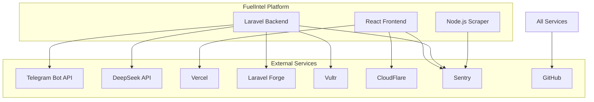
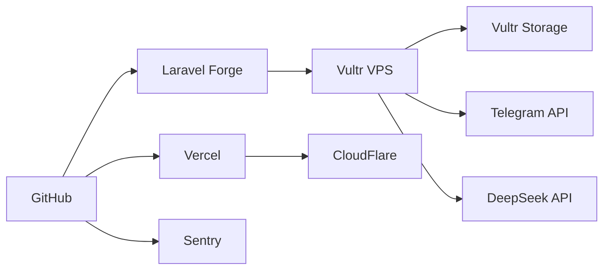

# External Services Documentation

## Overview

This document outlines all external services used by FuelIntel, their configuration requirements, setup instructions, and associated costs.

## Service Architecture



## 1. GitHub Repository

### Purpose

Version control, CI/CD, and team collaboration.

### Setup Instructions

1. Create new repository at github.com/new
2. Repository name: `fuelintel`
3. Initialize with README: No (we have one)
4. Add .gitignore: No (we have one)
5. License: Choose appropriate (MIT recommended)

### Configuration

```bash
# Add remote to local repository
git remote add origin https://github.com/YOUR_USERNAME/fuelintel.git
git branch -M main
git push -u origin main
```

### Branch Protection Rules

1. Go to Settings → Branches
2. Add rule for `main` branch:
   - Require pull request reviews: ✓
   - Dismiss stale pull request approvals: ✓
   - Require status checks: ✓
   - Include administrators: ✓

### Required Secrets

Add these in Settings → Secrets → Actions:

- `VERCEL_TOKEN`
- `VERCEL_PROJECT_ID`
- `VERCEL_ORG_ID`
- `FORGE_WEBHOOK_URL`
- `SENTRY_AUTH_TOKEN`
- `SENTRY_ORG`

### Cost

- Public repository: Free
- Private repository: Free (with limitations) or $4/user/month

---

## 2. Telegram Bot

### Purpose

User notifications and bot interface for price alerts.

### Setup Instructions

1. **Create Bot**
   - Open Telegram and search for @BotFather
   - Send `/newbot`
   - Choose name: "FuelIntel Bot"
   - Choose username: `@FuelIntelBot` (must end in 'bot')
   - Save the token provided

2. **Configure Bot**

   ```
   /setdescription
   FuelIntel - Track Mexican gas prices and get alerts

   /setcommands
   start - Start using the bot
   help - Show help information
   subscribe - Subscribe to a gas station
   unsubscribe - Unsubscribe from a station
   list - List your subscriptions
   alert - Configure price alerts
   status - Check bot status
   ```

3. **Set Webhook (after deployment)**
   ```bash
   curl -F "url=https://your-api-domain.com/api/telegram/webhook" \
        https://api.telegram.org/bot<YOUR_BOT_TOKEN>/setWebhook
   ```

### Environment Variables

```env
TELEGRAM_BOT_TOKEN=123456789:ABCdefGHIjklMNOpqrsTUVwxyz
TELEGRAM_WEBHOOK_URL=https://your-api-domain.com/api/telegram/webhook
TELEGRAM_WEBHOOK_SECRET=generate_random_string_here
```

### Cost

Free

---

## 3. DeepSeek API

### Purpose

Spanish natural language processing for intelligent alerts and insights.

### Setup Instructions

1. **Create Account**
   - Visit [platform.deepseek.com](https://platform.deepseek.com)
   - Sign up with email
   - Verify email address

2. **Generate API Key**
   - Go to API Keys section
   - Click "Create new API key"
   - Name it: "FuelIntel Production"
   - Copy and save the key

3. **Add Credits**
   - Go to Billing section
   - Add initial credits ($10-20 recommended)
   - Monitor usage regularly

4. **Test API**
   ```bash
   curl https://api.deepseek.com/v1/chat/completions \
     -H "Authorization: Bearer YOUR_API_KEY" \
     -H "Content-Type: application/json" \
     -d '{
       "model": "deepseek-chat",
       "messages": [
         {"role": "user", "content": "Hola, analiza este precio: Regular $22.50"}
       ]
     }'
   ```

### Environment Variables

```env
DEEPSEEK_API_KEY=dsk_xxxxxxxxxxxxxxxxxxxx
DEEPSEEK_API_URL=https://api.deepseek.com/v1
DEEPSEEK_MODEL=deepseek-chat
```

### Cost

- Pay per token usage
- Estimated: $10-50/month depending on usage
- Monitor usage in dashboard

---

## 4. Vercel

### Purpose

Frontend hosting with global CDN and automatic deployments.

### Setup Instructions

1. **Create Account**
   - Visit [vercel.com](https://vercel.com)
   - Sign up with GitHub

2. **Import Project**
   - Click "New Project"
   - Import GitHub repository
   - Configure project:
     - Framework Preset: Vite
     - Root Directory: `apps/web`
     - Build Command: `npm run build`
     - Output Directory: `dist`

3. **Environment Variables**
   Add in Vercel dashboard:

   ```
   VITE_API_URL=https://api.fuelintel.mx/api
   VITE_SENTRY_DSN=your_sentry_dsn_here
   ```

4. **Get Deployment Tokens**
   - Go to Account Settings → Tokens
   - Create new token: "GitHub Actions"
   - Save token for GitHub Secrets

### Cost

- Hobby (Free): 100GB bandwidth, SSL, unlimited deployments
- Pro: $20/month (if needed for team features)

---

## 5. Laravel Forge + Vultr

### Purpose

Server management and hosting for Laravel API and scraper.

### Laravel Forge Setup

1. **Create Account**
   - Visit [forge.laravel.com](https://forge.laravel.com)
   - Sign up and choose plan ($12/month)

2. **Connect Vultr**
   - Go to Account → Server Providers
   - Add Vultr API key (from Vultr dashboard)

3. **Provision Server**
   - Click "Create Server"
   - Provider: Vultr
   - Region: Choose closest to Mexico (Miami recommended)
   - Type: High Frequency (2GB RAM minimum)
   - PHP Version: 8.3
   - Database: PostgreSQL 15

4. **Configure Site**
   - Add site: api.fuelintel.mx
   - Repository: GitHub repo
   - Branch: main
   - Deploy script: Custom (see below)

### Vultr Setup

1. **Create Account**
   - Visit [vultr.com](https://vultr.com)
   - Add payment method

2. **Get API Key**
   - Account → API → Personal Access Token
   - Create token for Forge

3. **Object Storage**
   - Products → Object Storage
   - Create new: "fuelintel-reports"
   - Region: Same as server
   - Get S3 credentials

### Deploy Script

```bash
cd /home/forge/api.fuelintel.mx
git pull origin main
cd apps/api
composer install --no-dev --optimize-autoloader
php artisan migrate --force
php artisan config:cache
php artisan route:cache
php artisan view:cache
php artisan queue:restart
```

### Environment Variables (Vultr S3)

```env
AWS_ACCESS_KEY_ID=your_access_key
AWS_SECRET_ACCESS_KEY=your_secret_key
AWS_DEFAULT_REGION=ewr
AWS_BUCKET=fuelintel-reports
AWS_ENDPOINT=https://ewr1.vultrobjects.com
AWS_USE_PATH_STYLE_ENDPOINT=true
```

### Cost

- Laravel Forge: $12/month
- Vultr VPS (2GB): $12/month
- Vultr Object Storage: $5/month
- Total: ~$29/month

---

## 6. CloudFlare (Optional)

### Purpose

CDN, DDoS protection, and performance optimization.

### Setup Instructions

1. **Create Account**
   - Visit [cloudflare.com](https://cloudflare.com)
   - Sign up for free account

2. **Add Site** (if you have a domain)
   - Add site: fuelintel.mx
   - Update nameservers at registrar
   - Wait for propagation

3. **Configure CDN**
   - SSL/TLS: Full (strict)
   - Page Rules:
     - `api.fuelintel.mx/*` → Cache Level: Bypass
     - `*.fuelintel.mx/assets/*` → Cache Level: Cache Everything

4. **Get Analytics Token**
   - Analytics → Web Analytics
   - Add site
   - Get beacon token

### Cost

- Free plan: Sufficient for most needs
- Pro: $20/month (if needed)

---

## 7. Sentry

### Purpose

Error tracking and performance monitoring for all applications.

### Setup Instructions

1. **Create Account**
   - Visit [sentry.io](https://sentry.io)
   - Sign up with GitHub

2. **Create Organization**
   - Name: fuelintel
   - Slug: fuelintel

3. **Create Projects**

   **Frontend Project:**
   - Platform: React
   - Name: fuelintel-web
   - Get DSN

   **Backend Project:**
   - Platform: Laravel
   - Name: fuelintel-api
   - Get DSN

   **Scraper Project:**
   - Platform: Node.js
   - Name: fuelintel-scraper
   - Get DSN

4. **Configure Source Maps** (for React)

   ```bash
   npm install --save-dev @sentry/cli
   ```

5. **Get Auth Token**
   - Settings → Auth Tokens
   - Create token with project:write scope

### Environment Variables

```env
# Laravel
SENTRY_LARAVEL_DSN=https://xxx@xxx.ingest.sentry.io/xxx

# React
VITE_SENTRY_DSN=https://xxx@xxx.ingest.sentry.io/xxx

# Scraper
SENTRY_DSN=https://xxx@xxx.ingest.sentry.io/xxx
```

### Cost

- Developer (Free): 5K errors/month
- Team: $26/month (if needed)

---

## Service Dependencies



---

## Total Monthly Costs

### Essential Services

- Laravel Forge: $12
- Vultr VPS: $12
- Vultr Storage: $5
- **Subtotal: $29/month**

### Variable Costs

- DeepSeek API: ~$10-50/month
- **Subtotal: $10-50/month**

### Optional Services

- Vercel Pro: $20/month
- CloudFlare Pro: $20/month
- Sentry Team: $26/month

### Total Estimated Cost

- **Minimum (Essential + API): ~$39/month**
- **Typical: ~$50-80/month**
- **Full Featured: ~$115/month**

---

## Troubleshooting

### Telegram Bot Not Responding

1. Check webhook URL is correct
2. Verify SSL certificate is valid
3. Check bot token is correct
4. Review Laravel logs for errors

### DeepSeek API Errors

1. Verify API key is valid
2. Check credit balance
3. Review rate limits
4. Test with curl command

### Vercel Deployment Fails

1. Check build logs in Vercel dashboard
2. Verify environment variables
3. Test build locally first
4. Check Node version compatibility

### Forge Deployment Issues

1. Check deployment log in Forge
2. SSH to server and check Laravel logs
3. Verify database migrations
4. Check file permissions

### Sentry Not Receiving Events

1. Verify DSN is correct
2. Check environment configuration
3. Test with manual error
4. Review network/firewall settings

---

## Backup Services

### Alternative to Vultr

- DigitalOcean (similar pricing)
- Linode (similar pricing)
- AWS EC2 (more complex, pay-as-you-go)

### Alternative to DeepSeek

- OpenAI API (more expensive)
- Anthropic Claude API
- Local LLM (requires more resources)

### Alternative to Laravel Forge

- Ploi.io (similar features)
- ServerPilot
- Manual server management

### Alternative to Vercel

- Netlify (similar features)
- Cloudflare Pages (free)
- GitHub Pages (static only)

---

## Security Best Practices

1. **API Keys**
   - Never commit to repository
   - Rotate regularly
   - Use different keys for dev/staging/production

2. **Webhooks**
   - Always verify webhook signatures
   - Use HTTPS only
   - Implement rate limiting

3. **Database**
   - Use strong passwords
   - Restrict IP access
   - Regular backups

4. **Monitoring**
   - Set up alerts for errors
   - Monitor API usage
   - Track deployment status

---

## Quick Setup Checklist

- [ ] GitHub repository created
- [ ] Branch protection configured
- [ ] Telegram bot created
- [ ] DeepSeek API key obtained
- [ ] Vercel project imported
- [ ] Laravel Forge account created
- [ ] Vultr server provisioned
- [ ] Vultr storage configured
- [ ] CloudFlare configured (optional)
- [ ] Sentry projects created
- [ ] All environment variables documented
- [ ] GitHub Secrets configured
- [ ] Initial deployment successful
- [ ] Monitoring configured
- [ ] Documentation complete
