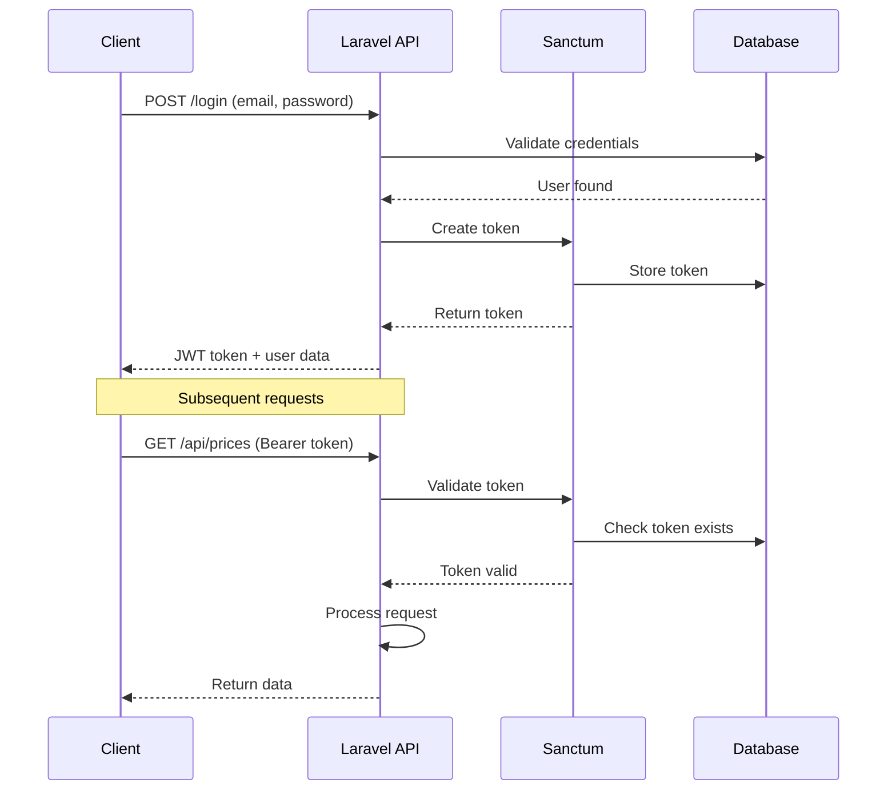

# Backend Architecture

## Service Architecture

### Controller Organization

```
/apps/api/app/
├── Http/
│   ├── Controllers/
│   │   ├── Auth/
│   │   │   ├── LoginController.php
│   │   │   └── RegisterController.php
│   │   ├── Api/
│   │   │   ├── PriceController.php
│   │   │   ├── StationController.php
│   │   │   ├── AlertController.php
│   │   │   └── AnalyticsController.php
│   │   └── Webhooks/
│   │       ├── TelegramController.php
│   │       └── ScraperController.php
│   ├── Middleware/
│   │   ├── RateLimit.php
│   │   └── VerifyApiToken.php
│   └── Requests/
│       ├── CreateAlertRequest.php
│       └── UpdatePriceRequest.php
├── Models/
├── Services/
├── Repositories/
└── Jobs/
```

### Controller Template

```php
<?php
// app/Http/Controllers/Api/PriceController.php
namespace App\Http\Controllers\Api;

use App\Http\Controllers\Controller;
use App\Services\PricingService;
use App\Repositories\PriceRepository;
use Illuminate\Http\Request;
use Illuminate\Support\Facades\Cache;

class PriceController extends Controller
{
    public function __construct(
        private PricingService $pricingService,
        private PriceRepository $priceRepository
    ) {}

    public function current(Request $request)
    {
        $filters = $request->validate([
            'entidad_id' => 'integer',
            'municipio_id' => 'integer',
            'fuel_type' => 'in:regular,premium,diesel',
            'page' => 'integer|min:1',
        ]);

        $cacheKey = 'prices:current:' . md5(json_encode($filters));

        return Cache::remember($cacheKey, 300, function () use ($filters) {
            return $this->priceRepository->getCurrentPrices($filters);
        });
    }

    public function nearby(Request $request)
    {
        $validated = $request->validate([
            'lat' => 'required|numeric|between:-90,90',
            'lng' => 'required|numeric|between:-180,180',
            'radius_km' => 'numeric|min:1|max:50',
        ]);

        $stations = $this->pricingService->findNearbyStations(
            $validated['lat'],
            $validated['lng'],
            $validated['radius_km'] ?? 5
        );

        return response()->json(['data' => $stations]);
    }

    public function history(string $stationNumero, Request $request)
    {
        $days = $request->input('days', 7);
        $fuelType = $request->input('fuel_type');

        $history = $this->priceRepository->getStationHistory(
            $stationNumero,
            $days,
            $fuelType
        );

        return response()->json($history);
    }
}
```

## Database Architecture

### Data Access Layer

```php
<?php
// app/Repositories/PriceRepository.php
namespace App\Repositories;

use App\Models\Station;
use App\Models\PriceChange;
use Illuminate\Support\Facades\DB;
use Carbon\Carbon;

class PriceRepository
{
    public function getCurrentPrices(array $filters = [])
    {
        $query = DB::table('stations as s')
            ->select([
                's.numero',
                's.nombre',
                's.direccion',
                's.lat',
                's.lng',
                DB::raw("
                    JSON_OBJECT(
                        'regular', (
                            SELECT price FROM price_changes
                            WHERE station_numero = s.numero
                            AND fuel_type = 'regular'
                            ORDER BY changed_at DESC
                            LIMIT 1
                        ),
                        'premium', (
                            SELECT price FROM price_changes
                            WHERE station_numero = s.numero
                            AND fuel_type = 'premium'
                            ORDER BY changed_at DESC
                            LIMIT 1
                        ),
                        'diesel', (
                            SELECT price FROM price_changes
                            WHERE station_numero = s.numero
                            AND fuel_type = 'diesel'
                            ORDER BY changed_at DESC
                            LIMIT 1
                        )
                    ) as current_prices
                ")
            ])
            ->where('s.is_active', true);

        if (isset($filters['entidad_id'])) {
            $query->where('s.entidad_id', $filters['entidad_id']);
        }

        if (isset($filters['municipio_id'])) {
            $query->where('s.municipio_id', $filters['municipio_id']);
        }

        return $query->paginate(50);
    }

    public function storePriceChange(array $data)
    {
        // Check if price actually changed
        $lastPrice = PriceChange::where('station_numero', $data['station_numero'])
            ->where('fuel_type', $data['fuel_type'])
            ->orderBy('changed_at', 'desc')
            ->first();

        if (!$lastPrice || $lastPrice->price != $data['price']) {
            return PriceChange::create([
                'station_numero' => $data['station_numero'],
                'fuel_type' => $data['fuel_type'],
                'subproducto' => $data['subproducto'],
                'price' => $data['price'],
                'changed_at' => $data['changed_at'] ?? now(),
                'detected_at' => now(),
            ]);
        }

        return null;
    }

    public function getStationHistory(string $stationNumero, int $days, ?string $fuelType = null)
    {
        $query = PriceChange::where('station_numero', $stationNumero)
            ->where('changed_at', '>=', Carbon::now()->subDays($days))
            ->orderBy('changed_at', 'desc');

        if ($fuelType) {
            $query->where('fuel_type', $fuelType);
        }

        return $query->get();
    }
}
```

## Authentication and Authorization

### Auth Flow Diagram



### Middleware/Guards

```php
<?php
// app/Http/Middleware/CheckSubscriptionTier.php
namespace App\Http\Middleware;

use Closure;
use Illuminate\Http\Request;

class CheckSubscriptionTier
{
    public function handle(Request $request, Closure $next, string $tier)
    {
        $user = $request->user();

        if (!$user) {
            return response()->json(['error' => 'Unauthorized'], 401);
        }

        $tierLevels = ['free' => 1, 'basic' => 2, 'premium' => 3];
        $requiredLevel = $tierLevels[$tier] ?? 1;
        $userLevel = $tierLevels[$user->subscription_tier] ?? 1;

        if ($userLevel < $requiredLevel) {
            return response()->json([
                'error' => 'Subscription tier insufficient',
                'required_tier' => $tier
            ], 403);
        }

        return $next($request);
    }
}

// app/Http/Middleware/RateLimit.php
namespace App\Http\Middleware;

use Closure;
use Illuminate\Http\Request;
use Illuminate\Support\Facades\RateLimiter;

class RateLimit
{
    public function handle(Request $request, Closure $next)
    {
        $user = $request->user();
        $key = 'api:' . ($user ? $user->id : $request->ip());
        $limit = $user ? $user->api_rate_limit : 60;

        if (RateLimiter::tooManyAttempts($key, $limit)) {
            return response()->json([
                'error' => 'Too many requests',
                'retry_after' => RateLimiter::availableIn($key)
            ], 429);
        }

        RateLimiter::hit($key, 3600); // 1 hour window

        $response = $next($request);

        $response->headers->set('X-RateLimit-Limit', $limit);
        $response->headers->set('X-RateLimit-Remaining', RateLimiter::remaining($key, $limit));

        return $response;
    }
}
```
