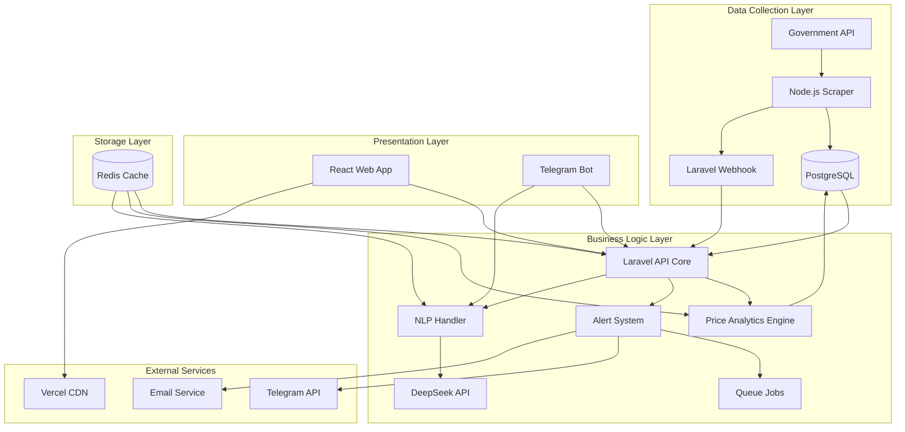

# Components

## Scraper Service (Node.js)

**Responsibility:** Automated collection of pricing data from government APIs with efficient change detection and storage

**Key Interfaces:**

- HTTP client for government API calls (api-reportediario.cne.gob.mx)
- PostgreSQL connection for direct price change writes
- Webhook POST to Laravel API upon completion
- Health check endpoint for monitoring

**Dependencies:** PostgreSQL database, Government API availability, Laravel API for notifications

**Technology Stack:** Node.js 20 LTS, Got for HTTP requests, node-postgres for DB, node-cron for scheduling, Winston for logging

## Laravel API Core

**Responsibility:** Central business logic hub handling authentication, data processing, API endpoints, and Telegram bot integration

**Key Interfaces:**

- RESTful API endpoints (OpenAPI spec defined)
- Telegram webhook receiver
- JWT token generation and validation
- Queue job processing for alerts

**Dependencies:** PostgreSQL for data, Redis for caching/sessions, DeepSeek API for NLP, Telegram API for bot

**Technology Stack:** Laravel 11, Sanctum for auth, BotMan for Telegram, Laravel Queues with Redis driver

## React Web Application

**Responsibility:** Mobile-first dashboard providing visual analytics, configuration, and comprehensive pricing intelligence UI

**Key Interfaces:**

- Axios HTTP client consuming Laravel API
- WebSocket connection for real-time updates (future)
- Local storage for user preferences
- Service worker for PWA functionality

**Dependencies:** Laravel API for all data, Vercel edge network for hosting

**Technology Stack:** React 18, TypeScript, Zustand for state, shadcn/ui components, Recharts for visualizations

## Price Analytics Engine

**Responsibility:** Calculate rankings, trends, market analysis, and generate insights from raw price data

**Key Interfaces:**

- Database queries for historical analysis
- Cache layer for expensive calculations
- API endpoints for trend data
- Alert trigger evaluation

**Dependencies:** PostgreSQL for historical data, Redis for cached calculations

**Technology Stack:** Laravel service classes, PostgreSQL window functions, Redis for result caching

## Alert & Notification System

**Responsibility:** Monitor price changes, evaluate alert conditions, and dispatch notifications across channels

**Key Interfaces:**

- Queue consumer for price change events
- Telegram message sender
- Email notification service
- Push notification API (future)

**Dependencies:** Laravel Queues, Redis, Telegram Bot API, Mail service

**Technology Stack:** Laravel Jobs, Laravel Notifications, BotMan for Telegram delivery

## NLP Conversation Handler

**Responsibility:** Process natural language queries in Spanish and convert to structured API calls

**Key Interfaces:**

- Telegram message receiver
- DeepSeek API integration
- Context session management
- Fallback command parser

**Dependencies:** DeepSeek API, Redis for conversation context, Telegram Bot

**Technology Stack:** Laravel service, BotMan middleware, Redis for session storage

## Component Interaction Diagram

