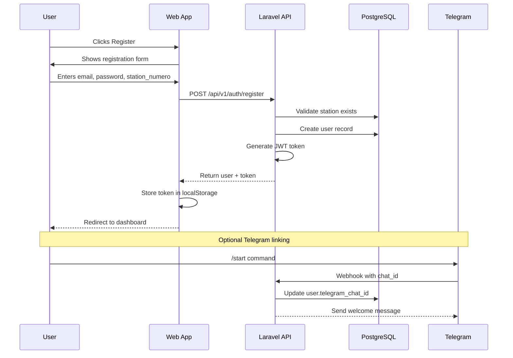
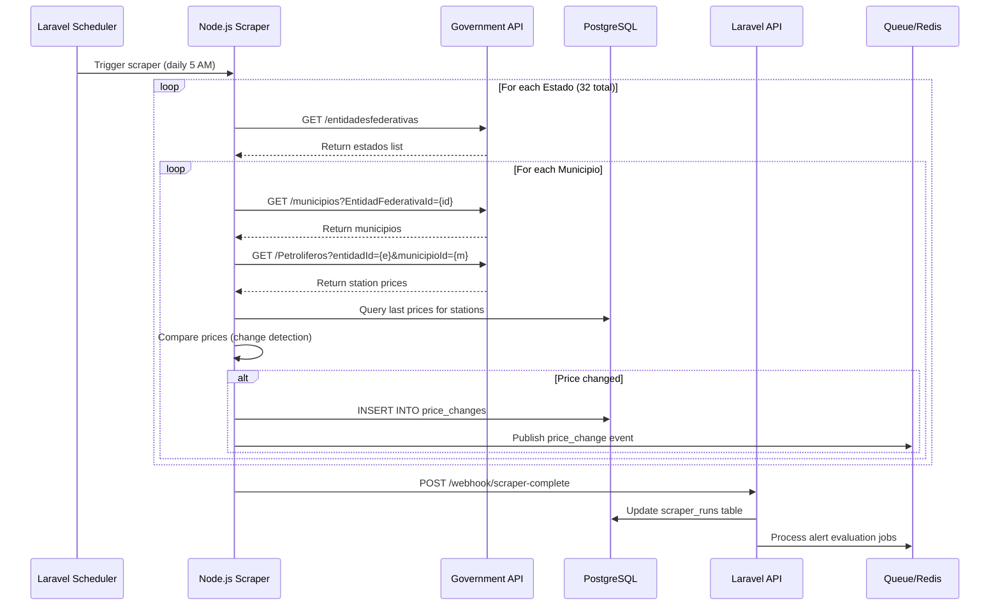
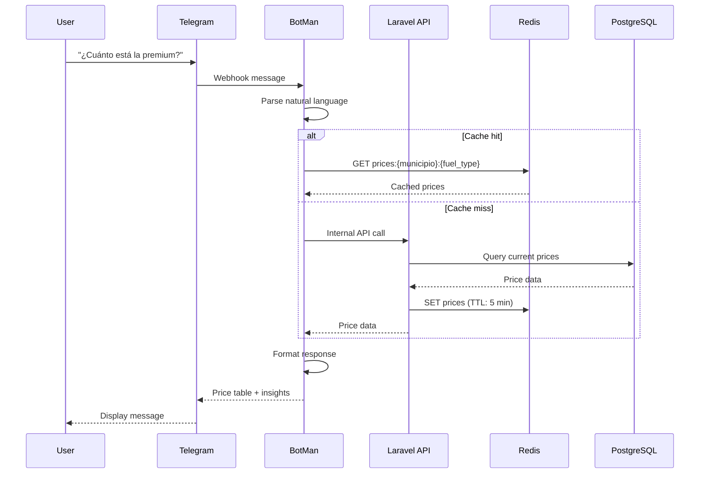
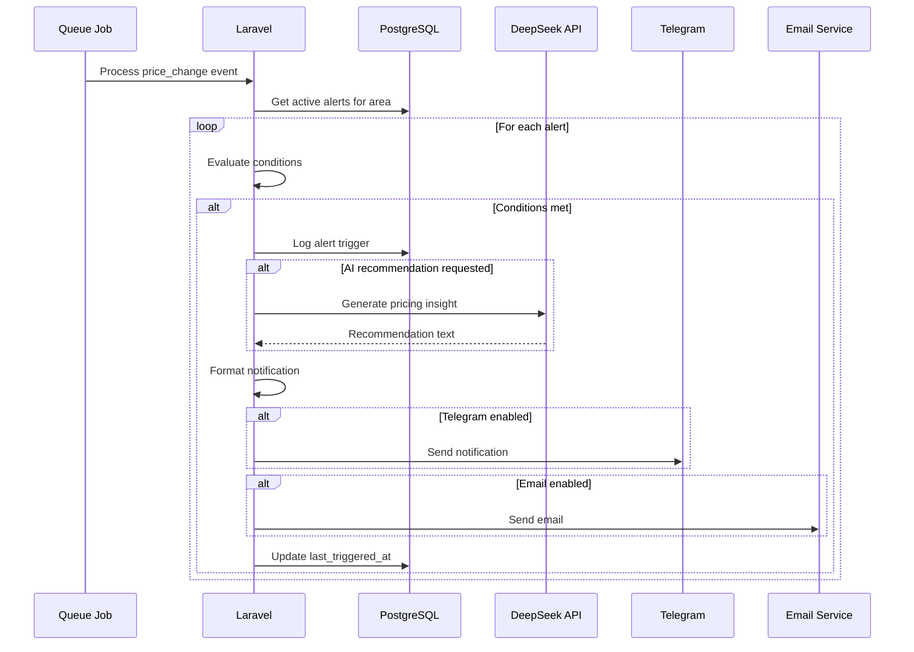

# Core Workflows

## User Registration & Station Setup

```mermaid
sequenceDiagram
    participant U as User
    participant W as Web App
    participant API as Laravel API
    participant DB as PostgreSQL
    participant T as Telegram

    U->>W: Clicks Register
    W->>U: Shows registration form
    U->>W: Enters email, password, station_numero
    W->>API: POST /api/v1/auth/register
    API->>DB: Validate station exists
    API->>DB: Create user record
    API->>API: Generate JWT token
    API-->>W: Return user + token
    W->>W: Store token in localStorage
    W-->>U: Redirect to dashboard

    Note over U,T: Optional Telegram linking
    U->>T: /start command
    T->>API: Webhook with chat_id
    API->>DB: Update user.telegram_chat_id
    API-->>T: Send welcome message
```

## Price Scraping Workflow

```mermaid
sequenceDiagram
    participant Cron as Laravel Scheduler
    participant S as Node.js Scraper
    participant Gov as Government API
    participant DB as PostgreSQL
    participant API as Laravel API
    participant Q as Queue/Redis

    Cron->>S: Trigger scraper (daily 5 AM)

    loop For each Estado (32 total)
        S->>Gov: GET /entidadesfederativas
        Gov-->>S: Return estados list

        loop For each Municipio
            S->>Gov: GET /municipios?EntidadFederativaId={id}
            Gov-->>S: Return municipios

            S->>Gov: GET /Petroliferos?entidadId={e}&municipioId={m}
            Gov-->>S: Return station prices

            S->>DB: Query last prices for stations
            S->>S: Compare prices (change detection)

            alt Price changed
                S->>DB: INSERT INTO price_changes
                S->>Q: Publish price_change event
            end
        end
    end

    S->>API: POST /webhook/scraper-complete
    API->>DB: Update scraper_runs table
    API->>Q: Process alert evaluation jobs
```

## Real-time Price Query Flow

```mermaid
sequenceDiagram
    participant U as User
    participant T as Telegram
    participant Bot as BotMan
    participant API as Laravel API
    participant Cache as Redis
    participant DB as PostgreSQL

    U->>T: "¿Cuánto está la premium?"
    T->>Bot: Webhook message
    Bot->>Bot: Parse natural language

    alt Cache hit
        Bot->>Cache: GET prices:{municipio}:{fuel_type}
        Cache-->>Bot: Cached prices
    else Cache miss
        Bot->>API: Internal API call
        API->>DB: Query current prices
        DB-->>API: Price data
        API->>Cache: SET prices (TTL: 5 min)
        API-->>Bot: Price data
    end

    Bot->>Bot: Format response
    Bot-->>T: Price table + insights
    T-->>U: Display message
```

## Alert Evaluation Workflow

```mermaid
sequenceDiagram
    participant Q as Queue Job
    participant API as Laravel
    participant DB as PostgreSQL
    participant AI as DeepSeek API
    participant T as Telegram
    participant E as Email Service

    Q->>API: Process price_change event
    API->>DB: Get active alerts for area

    loop For each alert
        API->>API: Evaluate conditions

        alt Conditions met
            API->>DB: Log alert trigger

            alt AI recommendation requested
                API->>AI: Generate pricing insight
                AI-->>API: Recommendation text
            end

            API->>API: Format notification

            alt Telegram enabled
                API->>T: Send notification
            end

            alt Email enabled
                API->>E: Send email
            end

            API->>DB: Update last_triggered_at
        end
    end
```
