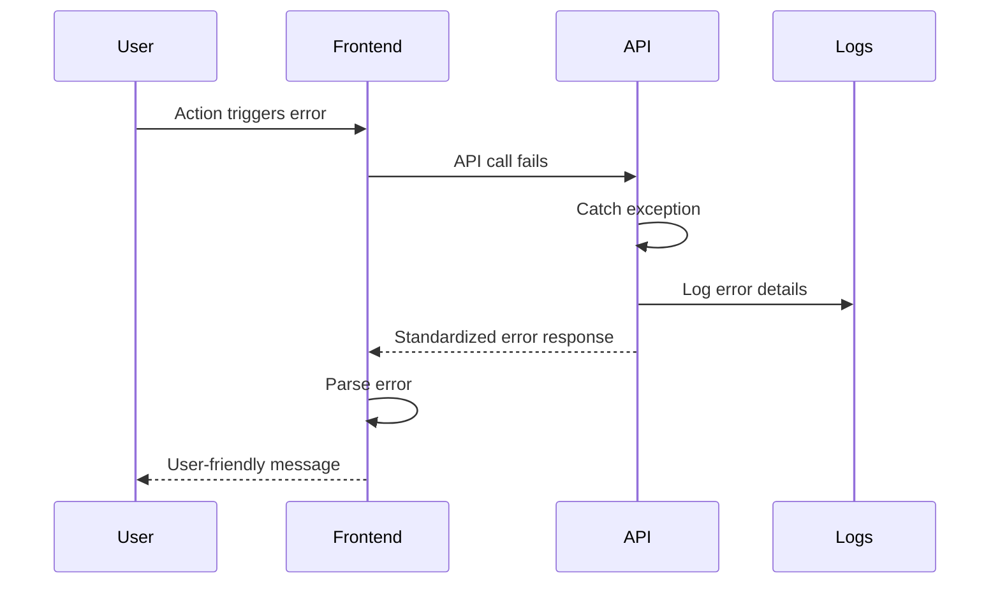

# Error Handling Strategy

## Error Flow



## Error Response Format

```typescript
interface ApiError {
  error: {
    code: string; // e.g., "PRICE_NOT_FOUND"
    message: string; // User-friendly Spanish message
    details?: Record<string, any>;
    timestamp: string;
    requestId: string;
  };
}
```

## Frontend Error Handling

```typescript
// services/error-handler.ts
export const handleApiError = (error: AxiosError<ApiError>) => {
  const apiError = error.response?.data?.error;

  if (apiError) {
    // Show localized message
    toast.error(apiError.message);

    // Log to monitoring
    Sentry.captureException(error, {
      extra: { requestId: apiError.requestId },
    });
  } else {
    // Generic error
    toast.error("Algo salió mal. Por favor intenta de nuevo.");
  }
};
```

## Backend Error Handling

```php
// app/Exceptions/Handler.php
public function render($request, Throwable $exception)
{
    if ($request->expectsJson()) {
        $code = $this->getErrorCode($exception);
        $message = $this->getUserMessage($exception);

        return response()->json([
            'error' => [
                'code' => $code,
                'message' => $message,
                'timestamp' => now()->toIso8601String(),
                'requestId' => $request->header('X-Request-ID', uniqid()),
            ]
        ], $this->getStatusCode($exception));
    }

    return parent::render($request, $exception);
}
```
