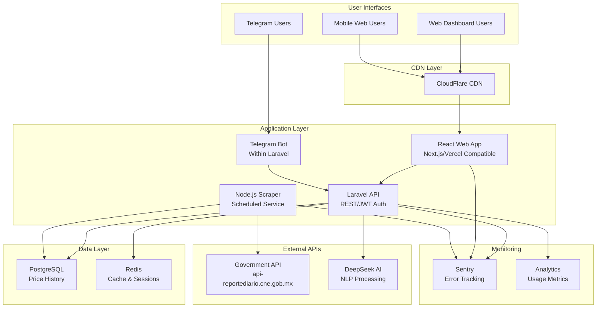

# High Level Architecture

## Technical Summary

FuelIntel employs a microservices-oriented architecture with three specialized applications in a monorepo structure: a Node.js scraper for government API data collection, a Laravel API backend serving as the central business logic hub, and a React frontend for the mobile-first web dashboard. The platform integrates with Telegram for conversational interfaces, uses PostgreSQL for efficient historical price tracking with change-only storage, and leverages Redis for caching and session management. Infrastructure deployment targets cloud platforms (AWS/Vercel/Supabase options) with auto-scaling capabilities, CDN distribution, and 99.9% uptime SLA. This architecture achieves the PRD goals of sub-3 second response times, supporting 500+ concurrent users, and transforming 30-minute manual price checking into 2-minute automated insights.

## Platform and Infrastructure Choice

**Platform:** Vercel (React frontend) + Laravel Forge/Vultr (Laravel API & Node.js scraper)
**Key Services:**

- Vercel: React app hosting with edge functions and CDN
- Laravel Forge: Server management, deployment automation, SSL
- Vultr: VPS hosting for Laravel and Node.js apps
- Forge-managed PostgreSQL and Redis on same Vultr instance
  **Deployment Host and Regions:**
- Frontend: Vercel Edge Network (global)
- Backend: Vultr (choose Mexico City or Miami for low latency to Mexico)

## Repository Structure

**Structure:** Monorepo with workspaces
**Monorepo Tool:** npm workspaces (simpler than Nx/Turborepo for 3-app structure)
**Package Organization:**

```
/apps (scraper, api, web)
/packages (shared types, utilities, constants)
/infrastructure (Docker, deployment configs)
```

## High Level Architecture Diagram



## Architectural Patterns

- **Microservices Architecture:** Three specialized services (scraper, API, frontend) with clear boundaries - _Rationale:_ Allows independent scaling and technology optimization per service
- **API-First Design:** Central Laravel API consumed by both web and bot interfaces - _Rationale:_ Ensures consistency and single source of truth for business logic
- **Event-Driven Scraping:** Scheduled jobs trigger scraper with webhook callbacks - _Rationale:_ Decouples data collection from API availability
- **Repository Pattern:** Abstract database access in Laravel - _Rationale:_ Enables testing and future database flexibility
- **Component-Based UI:** Reusable React components with shadcn/ui - _Rationale:_ Rapid development with consistent UX
- **Change Detection Pattern:** Store only price changes, not snapshots - _Rationale:_ Massive storage optimization for permanent history
- **Cache-Aside Pattern:** Redis caching with PostgreSQL fallback - _Rationale:_ Performance optimization while maintaining data integrity
- **BFF for Telegram:** Bot-specific endpoints within Laravel - _Rationale:_ Optimized responses for conversational interface
- **Jamstack-Compatible Frontend:** Static generation capable for marketing pages - _Rationale:_ SEO and performance benefits
- **Circuit Breaker:** For external API calls (government, AI) - _Rationale:_ Resilience against third-party failures
