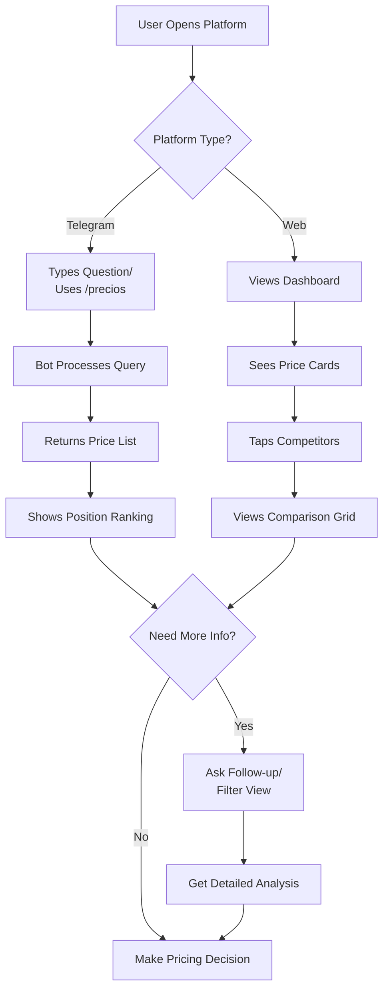
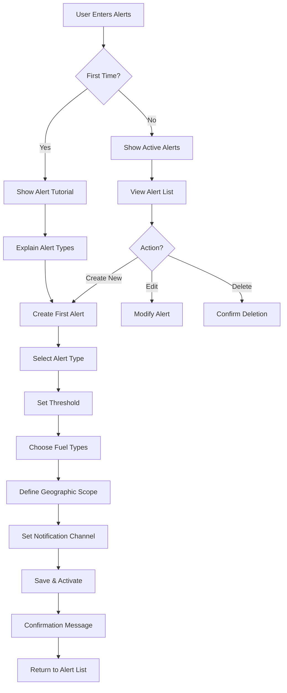

# FuelIntel UI/UX Specification

## Introduction

This document defines the user experience goals, information architecture, user flows, and visual design specifications for FuelIntel's user interface. It serves as the foundation for visual design and frontend development, ensuring a cohesive and user-centered experience.

### Overall UX Goals & Principles

### Change Log

| Date       | Version | Description                          | Author            |
| ---------- | ------- | ------------------------------------ | ----------------- |
| 2025-01-13 | 1.0     | Initial UI/UX specification creation | Sally (UX Expert) |

## Overall UX Goals & Principles

### Target User Personas

**Primary: Carlos the Independent Owner**

- Owns 1-3 gas stations in central Mexico
- Makes pricing decisions multiple times per day
- Heavy WhatsApp/Telegram user, always on mobile
- Needs instant answers, not complex dashboards
- Pain point: Spends 30+ minutes daily checking competitor prices manually

**Secondary: Maria the Regional Manager**

- Manages 5-20 stations across multiple municipios
- Creates pricing strategies and reports for ownership
- Comfortable with data but time-constrained
- Uses both mobile (on-the-go) and desktop (for analysis)
- Pain point: Consolidating data from multiple sources for decision-making

**Tertiary: Luis the Data-Driven Operator**

- Tech-savvy millennial owner embracing digital transformation
- Wants predictive analytics and automation
- Early adopter willing to try AI-powered recommendations
- Values efficiency and competitive advantage through technology
- Pain point: Existing tools are either too basic or unnecessarily complex

### Usability Goals

1. **Speed to Insight: 30-Second Rule** - Any pricing question must be answerable within 30 seconds from opening the app/bot
2. **Single-Thumb Operation** - All critical mobile actions accessible with one-handed use
3. **Zero Training Required** - New users complete first meaningful task without instructions
4. **Forgiveness by Design** - All actions reversible, destructive actions require confirmation
5. **Contextual Intelligence** - System anticipates needs based on time of day and market conditions
6. **Offline Resilience** - Core data viewable even without connection (cached prices)

### Design Principles

1. **🗣️ Conversational Over Complex** - Natural language is the primary interface; dashboards support but don't lead
2. **📱 Mobile-First, Desktop-Enhanced** - Optimize for smartphones, progressively enhance for larger screens
3. **⚡ Speed Over Features** - Performance and instant response trump feature richness
4. **🎯 Proactive Over Reactive** - Anticipate user needs with smart alerts rather than waiting for queries
5. **🚦 Progressive Disclosure** - Start simple, reveal complexity only when needed
6. **🌮 Culturally Mexican** - Use familiar terms, local patterns, and Mexican Spanish throughout

## Information Architecture (IA)

### Site Map / Screen Inventory

```mermaid
graph TD
    A[FuelIntel Platform] --> B[Telegram Bot]
    A --> C[Web Dashboard]

    B --> B1[Conversational Interface]
    B1 --> B1a[Natural Language Queries]
    B1 --> B1b[Command Menu]
    B1 --> B1c[Quick Actions]

    B --> B2[Commands]
    B2 --> B2a[/precios - Current Prices]
    B2 --> B2b[/competencia - Competitors]
    B2 --> B2c[/tendencias - Trends]
    B2 --> B2d[/alertas - Notifications]
    B2 --> B2e[/configurar - Settings]

    C --> C1[Authentication]
    C1 --> C1a[Login]
    C1 --> C1b[Register]
    C1 --> C1c[Password Reset]

    C --> C2[Dashboard Home]
    C2 --> C2a[Price Overview Cards]
    C2 --> C2b[Quick Stats]
    C2 --> C2c[Alert Summary]
    C2 --> C2d[Market Position Widget]

    C --> C3[Prices]
    C3 --> C3a[My Station]
    C3 --> C3b[Competitors Grid]
    C3 --> C3c[Map View]
    C3 --> C3d[Compare Tool]

    C --> C4[Alerts]
    C4 --> C4a[Active Alerts]
    C4 --> C4b[Alert History]
    C4 --> C4c[Configure Rules]
    C4 --> C4d[Notification Settings]

    C --> C5[Analytics]
    C5 --> C5a[Historical Trends]
    C5 --> C5b[Price Rankings]
    C5 --> C5c[Market Analysis]

    C --> C6[Settings]
    C6 --> C6a[Station Profile]
    C6 --> C6b[Account Settings]
    C6 --> C6c[Subscription]
```

### Navigation Structure

**Primary Navigation (Web):**

- **Mobile:** Bottom tab bar with 5 icons - Home, Prices, Alerts (with badge), Analytics, Settings
- **Desktop:** Left sidebar with expanded labels, icons, and alert count badges
- **Persistent Elements:** Station name/ID in header, notification bell (redundant but expected), user avatar

**Secondary Navigation:**

- **Contextual Filters:** Fuel type selector, date range picker, geographic scope
- **Quick Actions Bar:** "Check Prices", "View Alerts", "Compare Competitors"
- **Search:** Global search for stations by name or location

**Breadcrumb Strategy:**

- Show on desktop only (not needed on mobile due to simpler hierarchy)
- Format: Home > Section > Subsection
- Clickable for navigation, current page non-clickable
- Hidden on Telegram (linear conversation flow)

**Bot Navigation:**

- **Persistent Menu:** Always-visible command buttons in Telegram (MVP-appropriate flat structure)
- **Inline Keyboards:** Context-specific options after each response
- **Back/Cancel:** Universal "/cancelar" command returns to main menu
- **Conversation State:** Maintains context for 30 minutes for follow-up questions

**Alert Badge Strategy:**

- Show unread alert count on Alerts nav item
- Max display "99+" for counts over 99
- Clear badge when Alerts section is visited
- Separate badge for urgent vs informational alerts (red vs blue)

## User Flows

### Flow 1: Quick Price Check (Primary Flow)

**User Goal:** Check current competitor prices to make immediate pricing decision

**Entry Points:**

- Telegram bot conversation
- Web dashboard home screen
- Push notification tap

**Success Criteria:** User views competitor prices and understands market position within 30 seconds

#### Flow Diagram



#### Edge Cases & Error Handling:

- No competitors in selected radius → Expand search area automatically with notification
- API data stale (>2 hours) → Show cached data with "Last updated" warning
- Natural language not understood → Fallback to command menu with suggestions
- Network timeout → Show offline mode with cached prices

**Notes:** This is the most critical flow - must be optimized for speed and clarity. Consider adding voice input for Telegram in future iteration.

### Flow 2: Price Alert Configuration

**User Goal:** Set up automated alerts for competitor price changes

**Entry Points:**

- Telegram /alertas command
- Web Alerts section
- Onboarding flow suggestion

**Success Criteria:** User successfully creates alert rule and receives first notification

#### Flow Diagram



#### Edge Cases & Error Handling:

- Threshold too sensitive (>20 alerts/day) → Warning with suggestion to adjust
- Overlapping alert rules → Consolidation suggestion to reduce noise
- Telegram not connected → Prompt to link account or choose web notifications
- Invalid threshold values → Inline validation with helpful limits

**Notes:** Alert fatigue is a real risk - implement smart grouping and daily digest options.

### Flow 3: Historical Trend Analysis

**User Goal:** Understand price patterns to identify optimal pricing windows

**Entry Points:**

- Analytics section navigation
- "Ver tendencias" bot command
- Alert recommendation link

**Success Criteria:** User identifies pricing pattern and makes strategic decision

#### Flow Diagram

```mermaid
graph TD
    A[User Seeks Trends] --> B{Platform?}
    B -->|Bot| C[/tendencias Command]
    B -->|Web| D[Navigate to Analytics]

    C --> E[Select Time Period]
    E --> F[Receive Trend Summary]
    F --> G[Text-based Insights]

    D --> H[View Trend Chart]
    H --> I[Adjust Filters]
    I --> J[Interactive Exploration]

    G --> K{Sufficient Info?}
    J --> K
    K -->|No| L[Request Different View]
    K -->|Yes| M[Identify Pattern]

    L --> N[Adjust Parameters]
    N --> H

    M --> O[Make Strategic Decision]
```

#### Edge Cases & Error Handling:

- Insufficient historical data (<7 days) → Show available data with explanation
- Complex pattern request → Suggest switching to web for visual analysis
- Chart rendering issues → Fallback to table view with trend indicators
- Time period beyond data availability → Show max available with note

**Notes:** Bot provides simplified insights; web offers full interactive charts. Consider adding pattern detection alerts in future.

## Wireframes & Mockups

**Primary Design Files:** To be created in Figma - [Figma Project Link Placeholder]

### Key Screen Layouts

#### Mobile Dashboard Home (Primary View)

**Purpose:** Immediate price awareness and market position at a glance

**Key Elements:**

- Station identifier header with location badge
- Current price cards (3 fuel types) with trend arrows
- "Your Position" ranking widget (e.g., "2nd cheapest in area")
- Competitor price summary (top 3 nearest)
- Active alerts banner (if any)
- Quick action buttons: "Update My Prices", "Check Competitors"

**Interaction Notes:**

- Pull-to-refresh updates all data
- Swipe on price cards to see historical mini-chart
- Tap any element for detailed view
- Floating action button for bot quick access

**Design File Reference:** Frame: Mobile/Dashboard-Home

#### Telegram Bot Conversation Interface

**Purpose:** Natural, conversational access to all pricing intelligence

**Key Elements:**

- Persistent menu button (hamburger icon)
- Chat bubbles with clear user/bot distinction
- Inline keyboards for quick responses
- Price tables formatted with monospace font
- Emoji indicators (🔴🟡🟢) for price competitiveness
- "Typing..." indicator during processing

**Interaction Notes:**

- Tap-and-hold for message options
- Inline buttons for follow-up actions
- Voice message support for queries
- Share button for price screenshots

**Design File Reference:** Frame: Bot/Conversation-Flow

#### Competitor Comparison Grid (Mobile)

**Purpose:** Detailed competitive analysis with sorting and filtering

**Key Elements:**

- Sticky filter bar (fuel type, radius)
- Competitor cards with:
  - Station name and brand
  - Distance indicator
  - Price for selected fuel
  - Price difference from user (+$0.50)
  - Last update timestamp
- Sort toggle (distance/price/brand)
- Map view toggle button

**Interaction Notes:**

- Swipe left on card for "Set Alert" action
- Tap card for full station details
- Infinite scroll with lazy loading
- Sticky "My Station" card at top for reference

**Design File Reference:** Frame: Mobile/Competitors-Grid

#### Alert Configuration Modal

**Purpose:** Simple, guided alert rule creation

**Key Elements:**

- Alert type selector (cards):
  - "Price Changes"
  - "New Competition"
  - "Market Trends"
- Threshold slider with preview
- Fuel type checkboxes
- Geographic scope selector
- Notification channel toggles (Telegram/Web/Email)
- "Test Alert" button
- Save/Cancel actions

**Interaction Notes:**

- Progressive disclosure - show options based on alert type
- Real-time preview of rule ("You'll be notified when...")
- Validation messages inline
- Success toast after save

**Design File Reference:** Frame: Mobile/Alert-Config

#### Analytics Trend Chart (Responsive)

**Purpose:** Visual price history and pattern identification

**Key Elements:**

- Time period selector (7d, 15d, 30d, Custom)
- Multi-line chart:
  - User prices (solid lines)
  - Market average (dashed line)
  - Competitor range (shaded area)
- Legend with toggles
- Key stats below chart (avg, min, max, volatility)
- Export/Share button

**Interaction Notes:**

- Pinch to zoom on mobile
- Tap point for detailed tooltip
- Swipe to pan through time
- Double-tap to reset view

**Design File Reference:** Frame: Analytics/Trend-Chart

## Component Library / Design System

**Design System Approach:** Leverage shadcn/ui components with Tailwind CSS for rapid development, customized with FuelIntel brand colors and Mexican market considerations. Components will be built with React + TypeScript, ensuring type safety and reusability across the platform.

### Core Components

#### Price Card

**Purpose:** Display fuel prices with visual indicators for quick scanning

**Variants:**

- Default (current price)
- Comparison (with difference indicator)
- Compact (for lists)
- Hero (dashboard featured)

**States:**

- Default (neutral gray border)
- Positive (green - below market)
- Warning (yellow - at market)
- Negative (red - above market)
- Loading (skeleton)
- Error (dashed border)

**Usage Guidelines:** Always show fuel type icon, price with 2 decimals, and trend arrow. Use color coding consistently: green = competitive advantage, red = higher than market. Include "last updated" timestamp for transparency.

#### Station Card

**Purpose:** Represent a gas station with key information and actions

**Variants:**

- Grid view (square aspect)
- List view (horizontal)
- Map marker (compact)
- Detailed (expanded info)

**States:**

- Default
- Selected/Active
- Hover (desktop only)
- Disabled (closed station)

**Usage Guidelines:** Always display station name, distance/location, and at least one price. Brand logo when available. Max 2 lines for station name with ellipsis. Distance in km with 1 decimal precision.

#### Alert Badge

**Purpose:** Indicate notification count and urgency level

**Variants:**

- Count (number display)
- Dot (presence indicator)
- Icon + Count (detailed)

**States:**

- Info (blue - general updates)
- Warning (yellow - price changes)
- Urgent (red - significant changes)
- Pulse (animated for new)

**Usage Guidelines:** Max display "99+" for counts over 99. Clear on section visit. Use pulse animation sparingly for critical alerts only. Ensure color is not sole indicator (include icon/number).

#### Data Table

**Purpose:** Display structured pricing data for comparison

**Variants:**

- Basic (prices only)
- Comparison (with differences)
- Sortable (with headers)
- Responsive (cards on mobile)

**States:**

- Default
- Sorted (column highlighted)
- Loading (skeleton rows)
- Empty (no data message)

**Usage Guidelines:** Sticky headers on scroll. Zebra striping optional based on density. Right-align numerical values. Sort indicators clear and clickable. Mobile: transform to cards below 768px.

#### Chart Container

**Purpose:** Consistent wrapper for all data visualizations

**Variants:**

- Line (trends)
- Bar (comparisons)
- Sparkline (inline mini)
- Combined (multiple series)

**States:**

- Default
- Loading (skeleton)
- Error (message overlay)
- Empty (no data illustration)

**Usage Guidelines:** Consistent color palette across all charts. Always include legend unless single series. Touch-friendly tooltips on mobile. Export button in top-right corner. Responsive sizing with minimum heights.

#### Input Field

**Purpose:** Consistent form inputs across platform

**Variants:**

- Text
- Number (with increment)
- Select dropdown
- Search (with icon)
- Currency (peso prefix)

**States:**

- Default
- Focused
- Error (red border + message)
- Success (green check)
- Disabled
- Loading (spinner)

**Usage Guidelines:** Label always visible (no placeholder-only). Error messages below field in red. Helper text in gray. Currency inputs auto-format with comma separators. Mobile: increase touch target to 44px minimum.

#### Action Button

**Purpose:** Primary interface for user actions

**Variants:**

- Primary (filled)
- Secondary (outlined)
- Ghost (text only)
- Icon (icon only)
- Floating (FAB)

**States:**

- Default
- Hover
- Active/Pressed
- Loading (spinner)
- Disabled

**Usage Guidelines:** Primary actions limited to 1-2 per screen. Loading state replaces text with spinner. Disabled state at 50% opacity. Icon buttons need tooltips on desktop. Minimum height 44px on mobile.

#### Navigation Tab

**Purpose:** Primary navigation component for mobile and desktop

**Variants:**

- Bottom bar (mobile)
- Sidebar item (desktop)
- Pill (sub-navigation)

**States:**

- Default
- Active (highlighted)
- Badge (with count)
- Disabled

**Usage Guidelines:** Active state uses primary color + bold label. Icons required for mobile, optional for desktop. Badge positioning consistent (top-right of icon). Smooth transitions between states.

## Branding & Style Guide

### Visual Identity

**Brand Guidelines:** FuelIntel Brand System v1.0 (to be developed)

### Color Palette

| Color Type | Hex Code                  | Usage                                 |
| ---------- | ------------------------- | ------------------------------------- |
| Primary    | #0EA5E9                   | Primary actions, active states, links |
| Secondary  | #6366F1                   | Secondary buttons, accents            |
| Accent     | #F59E0B                   | Alerts, important highlights          |
| Success    | #10B981                   | Positive states, below-market prices  |
| Warning    | #F59E0B                   | Caution states, at-market prices      |
| Error      | #EF4444                   | Error states, above-market prices     |
| Neutral    | #64748B, #94A3B8, #E2E8F0 | Text, borders, backgrounds            |

### Typography

#### Font Families

- **Primary:** Inter (clean, modern, excellent readability)
- **Secondary:** System UI stack (fallback for performance)
- **Monospace:** JetBrains Mono (price displays, data tables)

#### Type Scale

| Element | Size | Weight         | Line Height |
| ------- | ---- | -------------- | ----------- |
| H1      | 32px | 700 (Bold)     | 1.2         |
| H2      | 24px | 600 (Semibold) | 1.3         |
| H3      | 20px | 600 (Semibold) | 1.4         |
| Body    | 16px | 400 (Regular)  | 1.5         |
| Small   | 14px | 400 (Regular)  | 1.4         |

### Iconography

**Icon Library:** Lucide React (open source, comprehensive, consistent)

**Usage Guidelines:**

- Use outline style for navigation and actions
- Filled variants for selected/active states
- Consistent 24px size for primary actions, 20px for inline
- Fuel type icons: ⛽ Regular (green), ⛽ Premium (red), ⛽ Diesel (black)
- Directional arrows for trends: ↑ (increase), ↓ (decrease), → (stable)

### Spacing & Layout

**Grid System:**

- 12-column grid on desktop (1200px max width)
- 4-column grid on mobile
- 16px gutters, 24px margins on mobile, 32px on desktop

**Spacing Scale:**

- Base unit: 4px
- Scale: 4, 8, 12, 16, 24, 32, 48, 64, 96
- Consistent vertical rhythm using 24px baseline

## Accessibility Requirements

### Compliance Target

**Standard:** WCAG 2.1 AA compliance with specific considerations for Mexican gas station owner demographics (potentially older users, outdoor mobile usage)

### Key Requirements

**Visual:**

- Color contrast ratios: Minimum 4.5:1 for normal text, 3:1 for large text (18px+)
- Focus indicators: High-contrast 3px outline for keyboard navigation, visible against all backgrounds
- Text sizing: Base 16px minimum, user scalable up to 200% without horizontal scroll

**Interaction:**

- Keyboard navigation: All interactive elements accessible via Tab key, logical tab order following visual flow
- Screen reader support: Semantic HTML, ARIA labels for icons, live regions for price updates
- Touch targets: Minimum 44x44px on mobile, 8px spacing between targets

**Content:**

- Alternative text: Descriptive alt text for all charts/graphs, price trend descriptions
- Heading structure: Logical H1-H6 hierarchy, no skipped levels
- Form labels: Visible labels for all inputs, error messages programmatically associated

### Testing Strategy

**Automated Testing:**

- axe-core integration in development environment
- Lighthouse CI checks in build pipeline (target score: 90+)
- Color contrast validation in design tools

**Manual Testing:**

- Keyboard-only navigation testing for all user flows
- Screen reader testing with NVDA (Windows) and VoiceOver (iOS)
- Mobile accessibility testing in bright sunlight conditions
- Testing with users 50+ years old (target demographic consideration)

**Continuous Monitoring:**

- Monthly accessibility audits
- User feedback channel for accessibility issues
- Regular testing with actual gas station owners

## Responsiveness Strategy

### Breakpoints

| Breakpoint | Min Width | Max Width | Target Devices                     |
| ---------- | --------- | --------- | ---------------------------------- |
| Mobile     | 320px     | 767px     | Smartphones (iPhone SE to Pro Max) |
| Tablet     | 768px     | 1023px    | iPads, Android tablets             |
| Desktop    | 1024px    | 1919px    | Laptops, desktop monitors          |
| Wide       | 1920px    | -         | Large monitors, TV displays        |

### Adaptation Patterns

**Layout Changes:**

- **Mobile:** Single column, stacked cards, bottom navigation
- **Tablet:** 2-column grid for cards, sidebar navigation collapsed
- **Desktop:** 3-4 column grid, expanded sidebar, multi-panel views
- **Wide:** Maximum content width 1440px centered, additional data density

**Navigation Changes:**

- **Mobile:** Bottom tab bar with 5 items, hamburger menu for overflow
- **Tablet:** Collapsible sidebar, floating action buttons
- **Desktop:** Persistent sidebar with labels, breadcrumbs visible
- **Wide:** Mega-menu capabilities, quick access panels

**Content Priority:**

- **Mobile:** Current prices only, hide historical unless requested
- **Tablet:** Current + 7-day trend visible
- **Desktop:** Full analytics dashboard with multiple timeframes
- **Wide:** Additional competitive intelligence panels

**Interaction Changes:**

- **Mobile:** Swipe gestures, pull-to-refresh, long press for options
- **Tablet:** Hover states introduced, drag-and-drop for comparisons
- **Desktop:** Right-click context menus, keyboard shortcuts, tooltips
- **Wide:** Multi-select capabilities, advanced filtering panels

### Component-Specific Adaptations

**Price Cards:**

- Mobile: Vertical stack, 1 per row
- Tablet: 2 per row grid
- Desktop: 3-4 per row
- Wide: Horizontal with inline charts

**Data Tables:**

- Mobile: Transform to cards with key data
- Tablet: Horizontal scroll with frozen first column
- Desktop: Full table with all columns visible
- Wide: Additional columns with trends

**Charts:**

- Mobile: Simplified with fewer data points
- Tablet: Standard view with basic interactions
- Desktop: Full interactivity with zoom/pan
- Wide: Multiple charts side-by-side

**Forms:**

- Mobile: Single column, full-width inputs
- Tablet: 2-column layout where logical
- Desktop: Inline forms, multi-column
- Wide: Sidebar forms with live preview

## Animation & Micro-interactions

### Motion Principles

**Performance First:** All animations must maintain 60fps, with reduced motion options for accessibility
**Purposeful Movement:** Every animation serves a function - feedback, guidance, or continuity
**Snappy Timing:** Quick animations (200-300ms) for immediate feedback, slower (400-600ms) for transitions
**Natural Easing:** Use ease-out for entrances, ease-in for exits, ease-in-out for state changes
**Consistent Direction:** Price increases animate up, decreases animate down, maintaining mental model

### Key Animations

- **Price Update Pulse:** Brief scale (1.05) and color flash when price changes detected (Duration: 300ms, Easing: ease-out)
- **Loading Skeleton:** Shimmer effect moving left-to-right on skeleton screens (Duration: 1.5s, Easing: linear, infinite)
- **Card Hover Lift:** Subtle shadow increase and 2px translateY on desktop hover (Duration: 200ms, Easing: ease-out)
- **Tab Transition:** Sliding underline indicator for active tab changes (Duration: 250ms, Easing: ease-in-out)
- **Alert Badge Pulse:** Gentle scale pulse for new urgent alerts, 2 iterations only (Duration: 600ms, Easing: ease-in-out)
- **Success Checkmark:** Draw-in animation for successful actions (Duration: 400ms, Easing: ease-out)
- **Pull-to-Refresh:** Elastic bounce when pulling down, spinner rotation on release (Duration: 300ms, Easing: spring)
- **Number Ticker:** Count-up animation for price changes and statistics (Duration: 500ms, Easing: ease-out)
- **Chart Line Draw:** Lines animate from left to right on initial load (Duration: 800ms, Easing: ease-out)
- **Toast Notification:** Slide in from top/bottom with subtle bounce (Duration: 300ms, Easing: spring)
- **Modal Overlay:** Fade in background, scale up content from 0.95 (Duration: 200ms, Easing: ease-out)
- **Swipe Actions:** Follow finger movement, snap to action on release (Duration: 150ms, Easing: ease-out)

### Interaction Feedback

**Immediate (0-100ms):**

- Button press states
- Touch ripples
- Focus outlines

**Fast (100-300ms):**

- Hover states
- Menu opens
- Tab switches

**Smooth (300-600ms):**

- Page transitions
- Modal appearances
- Chart updates

**Deliberate (600ms+):**

- Initial page loads
- Complex data visualizations
- Onboarding sequences

## Performance Considerations

### Performance Goals

- **Page Load:** Initial meaningful paint < 1.5 seconds on 3G connection
- **Interaction Response:** All user inputs acknowledged within 100ms
- **Animation FPS:** Maintain 60fps for all animations, degrading gracefully on lower-end devices

### Design Strategies

**Image Optimization:**

- Lazy load all images below the fold
- WebP format with JPEG fallback for compatibility
- Responsive images with srcset for different screen sizes
- Station brand logos as SVG sprites (single HTTP request)
- Placeholder blur for price card images while loading

**Data Loading:**

- Progressive data fetching - show current prices immediately, load history async
- Implement virtual scrolling for competitor lists over 20 items
- Cache price data locally for 5 minutes (localStorage/IndexedDB)
- Preload next likely action data (e.g., load competitor details on hover)
- Aggregate API calls where possible (batch station queries)

**Rendering Optimization:**

- CSS-based animations over JavaScript where possible
- Use transform and opacity for animations (GPU acceleration)
- Debounce search inputs (300ms delay)
- Throttle scroll events (100ms)
- Code split by route - load Analytics only when needed

**Mobile-Specific:**

- Reduce animation complexity on battery saver mode
- Detect slow networks and reduce data payload
- Offline-first approach with service worker caching
- Minimize JavaScript bundle size (target < 200KB gzipped)
- Use system fonts to avoid font loading delay

**PWA Optimizations:**

- Service worker for offline functionality
- Cache static assets aggressively
- Background sync for price updates
- App shell architecture for instant loading

## Next Steps

### Immediate Actions

1. **Stakeholder Review** - Present this specification to technical team and business stakeholders for alignment
2. **Create Figma Design File** - Set up component library and begin high-fidelity mockups for MVP screens
3. **Technical Feasibility Review** - Validate performance goals with development team given infrastructure constraints
4. **User Testing Protocol** - Develop testing plan with 5-10 gas station owners for design validation
5. **Accessibility Audit Setup** - Configure automated testing tools in development environment
6. **Design-Dev Handoff Process** - Establish workflow for design tokens and component specifications

### Design Handoff Checklist

- [x] All user flows documented
- [x] Component inventory complete
- [x] Accessibility requirements defined
- [x] Responsive strategy clear
- [x] Brand guidelines incorporated
- [x] Performance goals established
- [ ] Figma designs created
- [ ] Design tokens exported
- [ ] Interactive prototype built
- [ ] User testing completed
- [ ] Edge cases designed
- [ ] Error states defined

## Checklist Results

_UI/UX checklist to be run against final Figma designs before development handoff_

---

**Document Version:** 1.0  
**Date:** January 13, 2025  
**Author:** Sally (UX Expert)  
**Status:** Ready for Design Implementation
